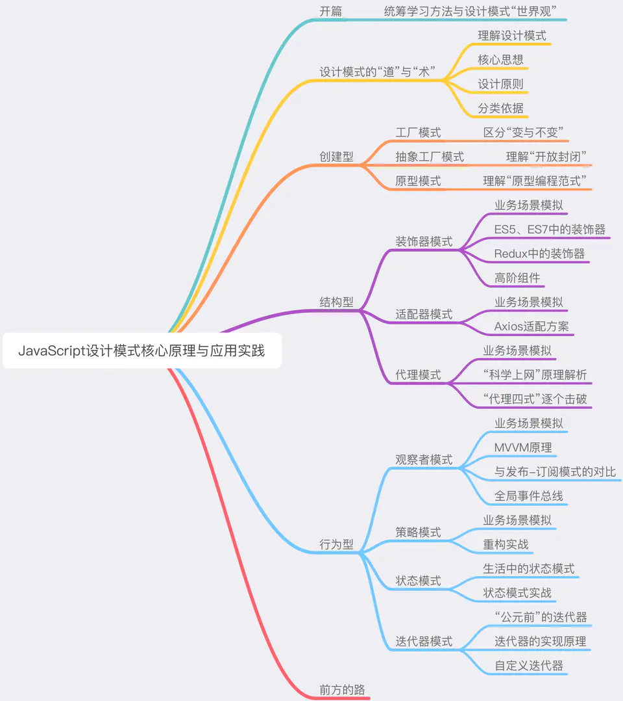

### ✍️ Tangxt ⏳ 2020-09-18 🏷️ 成长论、道与术

# 01-开篇：前端工程师的成长论

## ★开篇：前端工程师的成长论

### <mark>1）前端领域里边也有不变的知识</mark>

即使是在瞬息万变（形容短时间内就发生很多变化）的前端领域里边，也存在一些具备“**一次学习，终生受用**”特性的知识

- 前端性能优化的核心思路
- JavaScript 设计模式
- ……

### <mark>2）设计模式什么？</mark>

> 在软件工程中，设计模式（design pattern）是对软件设计中普遍存在（反复出现）的各种问题，所提出的**解决方案**。 ——维基百科

简单来说就是「套路」! 如烹饪有菜谱，游戏有攻略等等 -> 有了「套路」，我们就能**多快好省**地达成目标！

### <mark>3）在学习一门知识之前，你要做的？</mark>

搞清楚这块知识本身的：

1. 意义（为什么要学？）
2. 作用（学了它能干嘛？）
3. 特性（怎么学比较好？）

从而建立起自己的**全局观** —— 这个过程和知识本身同样重要

### <mark>4）前端工程师如何变秃变强？</mark>

💡：前端这岗位是不是真得饱和了？

> 前端团队真的很缺人；前端，真的太难招了

为什么难招？

很多情况下，受试者的**编码能力、设计思维和计算机基础**都不那么经得起推敲，纵使有再多的 [HC](https://www.zhihu.com/question/25120313) （headcount，名额） 也白搭。行业没有以前那么“景气”了，这不假，但情况远没有糟糕到人人自危的程度。

为什么有很多人说饱和呢？

因为「曾经站在风口上就能飞起来的猪，现在飞不起来了」。不过这没关系哈！努力修炼修炼，**做鹰就不怕了**。

总之，不管怎样，**前端领域距离人才饱和还有很长很长一段路要走**。所以说操心行业的未来意义不大，大家更应该去**思考如何去练下扎实的基本功、过硬的业务素质和灵活的适配能力**，这样便能**不畏变化**

对了，设计模式的**根本目的**是为了使我们的代码具备更强的**应对变化**的能力！ -> 需求多变，代码尚且有 23 式可对抗，更何况我们写代码的人呢？

💡：为什么有缺口却招不到人？

- 需求方和受试者双方的问题
- 前端这个行业的特性

大多数人都是野路子入行的：

> HTML & CSS -> jQuery（现在很多人可能没写过 jQuery 了） -> 热门框架 -> 仿站 -> 找工作

能够把这样一个过程完完整整走下来的我们，足以证明我们对编程的兴趣以及够格的执行力！

我们野路子入行只能走这样的路线，但是**把这些东西当作了一个合格前端需要/应该掌握的全部**那就过分了！

💡：前端的变与不变

- 变：原生 JS -> jQuery -> zepto -> Angular -> Vue/React -> ……（**学东西不卖力就会掉队**）
- 不变：驾驭技术的能力

能够决定一个前端工程师的**本质**的，不是那些瞬息万变的技术点，而是那些**不变的东西**。

那什么是不变的东西呢？

简单来说，有一团队发一招聘信息说「**重金求 Node 玩家，愿意给很高的 P 级**」！过来几天，有一培训机构的招生文案写到「**BAT 砸 xx 万招 Node 工程师，而你却还在学 PHP？!**」

你仔细品品，你会发现这个招生文案是很滑稽的 -> 为啥这样说呢？

你想想，Node 的语法难不难？不难对吧！准确地说，它足够友好了！我相信每个团队都不缺会用 Node 或者说用任何一门语言去写 Hello World 的同学 —— **缺的是能够驾驭这门语言、能凭借自己深刻的架构思想和工程思想去支配这门语言、利用它去创造牛逼产出的人。**

所谓“不变的东西”，说的就是这**种驾驭技术的能力**。

具体来说，它分为以下三个层次：

- 能用**健壮的代码**去解决具体的问题；
- 能用**抽象的思维**去应对复杂的系统；
- 能用**工程化的思想**去规划更大规模的业务

这三种能力在我们的成长过程中是层层递进的关系，而后两种能力可以说是对架构师的要求。事实上，在老师入行以来接触过的工程师里，能**做到第一点**，并且把它做到扎实、做到娴熟的人，已经**堪称同辈楷模**。

> 编程能力 -> 架构能力 -> 工程能力！

💡：为什么说「前端工程师，首先是软件工程师」？

吴军曾经说过：

> 基础理论知识是一个人的基线，理论越强基线越高。再为自己定一个目标和向上攀附的阶梯，那么达到目标就是时间问题，而很多野路子工程师搞了半辈子也未达到优秀工程师的基线，很多他们绞尽脑汁得出的高深学问，不过是正规工程师看起来很自然的东西。

技术人之间的撕逼，每次但凡想上升一点高度，都扯到「架构」上去互怼，其实大家的架构能力都不咋滴……很多人都有想成为架构师的激情，但是大多数人都**缺乏前边所提到的“不变能力”中最基本的那一点——用健壮的代码去解决具体的问题的能力**。这个能力在软件工程领域所对标的经典知识体系，恰恰就是设计模式。

总之，**想做靠谱开发，先掌握设计模式**。

> 请把你写的像翔一样的代码给改咯！不然，你就不要在这里装逼的谈「架构」!

### <mark>5）设计模式的学习之道</mark>

整本小册的知识体系与格局：

我们不需要学习 23 种设计模式，因为我们是前端，有些设计模式对于前端来说，并不适用，总之，我们要学的设计模式，得具备这两个特性：

1. 前端能用，而且好用
2. 面试会考，而且常考

通过学习这部分设计模式，我们至少可以达到三个目的：

1. 充分理解前端设计模式的核心思想和基本理念，在具体的场景中掌握抽象的设计原则
2. 会写代码，会写好代码；
3. 会面试，能言之有物。

💡：设计模式难学吗？

设计模式的“难”，在于其令人望而生畏的**抽象性**和知识点的**分散性**。这带来了本册要着重解决的问题——**帮助大家摆脱枯燥乏味的技术恐惧感**。

抽象性几乎是所有理论性知识共有的特性，它带来最直观的问题就是可能一段话你**每个字都认识，但连在一起不知道它在说啥：）**。于是产生了“这块知识看起来好牛逼，我一定学不会吧”这样的错觉。

其实设计模式并不高大上，它是一个非常接地气、非常实际的东西——因为它本身就是一帮非常苦逼的程序员在自己的职业生涯里实打实地**踩坑踩出来的**。解决知识抽象性带来的理解障碍，重要的不是反复的陈述、解释，而是**把自己放到一个正确的场景里，去体会这个模式的好**。在学习具体设计模式的过程中，我们每个章节都以原理 -> 实践 -> 总结这样的流程来走，也希望大家不要随意跳读，确保自己不仅是跟着看了，更是跟着做了。设计模式说起来是理论知识，但它**毕竟是人们在实践过程中总结、提炼出来的**，掌握它的意义，正是为了把它**还原到我们日常的实践中去**。

分散性则是因为设计模式本身就是一套**解决不同问题**的方案的集合，这些方案之间乍一看好像没有什么关联，故而很容易使学习者陷入边学边忘的窘境。

但所谓“分散性”其实也是纸老虎——深入了解设计模式后，大家会发现模式与模式间存在着不可忽略的共性与关联——在下一小节《设计模式的道与术》中，我们将会学习设计模式中几个重要的设计原则和核心的设计思想；接下来学习具体的设计模式时，小册会在具体的应用场景里把这些设计原则掰碎嚼烂了还原给大家。在这个过程中大家会发现，不同的设计模式并非是一座座的孤岛，他们之间彼此呼应、相互成就，共同构建起了一套完整而经典的软件思想体系。

此外，设计模式中有几个特别重要、特别好使、特别受面试官关注的的，我们在讲解的过程中会有针对性地穿插一些**高频面试真题**（注意面试题不一定会单开小节，有的面试题就穿插于原理讲解之中~）。具体是哪几个，可能要等大家读到了那一节才知道了哈哈（所以不要随便跳读：））。

设计模式中最核心的理念和思想有哪些，如何将设计模式从传统的 C++、Java 语言迁移到 JavaScript、从服务端业务场景迁移到现代化的前端应用场景，如何把握本书的重点难点 —— 在进入实战环节之前，我们首先需要走进《设计模式的道与术》中，对以上问题一窥究竟。

## ★总结

- 你咩有学过设计模式？ 那么你就不是一名合格的程序员！
- 解决知识抽象性带来的理解障碍，重要的不是反复的陈述、解释，而是把自己放到一个正确的场景里，去体会这个模式的好！ -> 这是一句很重要的话，我已经都在用一些反复解释的姿势去理解某些很抽象的概念，表面上看我好像对概念有很深的认识，实际上这只是很粗浅的认识！我必须把概念代入到某些正确的场景里边去理解它！
- 我最近在看方方的「旺财项目」教程，方方在写这个项目的过程中，就在不断地重构自己所写的代码 -> 模块化更强、代码更好维护、代码更短小精悍、代码语义性更好……

## ★Q&A

### <mark>1）「基线」是什么？</mark>

在计算机术语中，基线 (Baseline) 是软件文档或源码（或其它产出物）的一个稳定版本，它是**进一步开发的基础**。

吴军老师的那句话「基础理论知识是一个人的基线，理论越强基线越高……」 -> 我的理解是，「基线」代表着修炼的天赋，天赋越高修炼越快，基线越高，也就是基础理论知识越强，那么你之后学习新的东西也就越快！

➹：[什么是基线 (Baseline)_jixiangrurui 的专栏-CSDN 博客](https://blog.csdn.net/jixiangrurui/article/details/51406239)

➹：[软件开发中的基线_weixin_34026484 的博客-CSDN 博客](https://blog.csdn.net/weixin_34026484/article/details/85470756)

➹：[检查点、里程碑、基线-项目管理中的三个重要概念 - 知乎](https://zhuanlan.zhihu.com/p/102476281)
