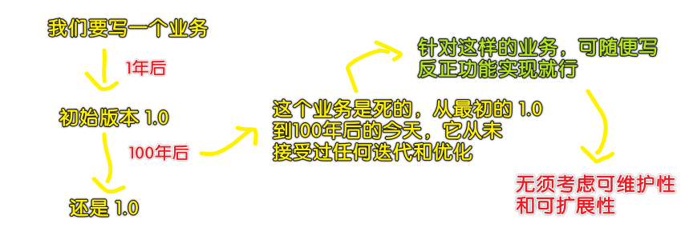
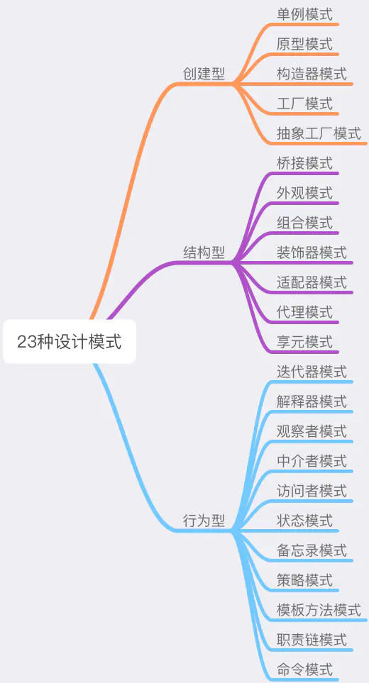

### ✍️ Tangxt ⏳ 2020-09-18 🏷️ 道与术

# 02-设计模式的「道」与「术」

## ★设计模式之道

> 道，是中华民族为认识自然为己所用的一个名词，意思是万事万物的运行轨道或轨迹，也可以说是事物变化运动的情况。

### <mark>1）设计模式的力量</mark>

我们学生时代做题的本能：

识别题目特征 —— catch 题目想要考查的知识点 —— 快速在脑海中映射出它对应的解决方法，这个过程在我们学生时代几乎是一个本能的、条件反射一样的脑回路机制。

在学习设计模式时，如果我们可以回忆起这种“**从映射到默写**”的思维方式，相信这个学习过程会是轻松的、自然的。

> 无脑式 -> `xxx`问题 -> `yyy`设计模式 -> 问题的关键是如何灵活运用设计模式！

### <mark>2）SOLID 设计原则</mark>

> "SOLID" 是由罗伯特·C·马丁在 21 世纪早期引入的记忆术首字母缩略字，指代了面向对象编程和面向对象设计的五个基本原则。

**设计原则是设计模式的指导理论**，它可以帮助我们规避不良的软件设计。SOLID 指代的五个基本原则分别是：

- 单一功能原则（Single Responsibility Principle）
- 开放封闭原则（Opened Closed Principle）
- 里式替换原则（Liskov Substitution Principle）
- 接口隔离原则（Interface Segregation Principle）
- 依赖反转原则（Dependency Inversion Principle）

这五个原则看起来高大尚，但实际上就是个纸老虎，当然，我们不需要每一个都掌握，因为 JS 设计模式中，主要用到的设计模式基本都围绕“**单一功能**”和“**开放封闭**”这两个原则来展开。

话说，如何学习这些设计原则？

> 在没有实际操作的情况下，干讲理论没有任何意义，反而会挫伤初学者的积极性。具体的原则、理论，我们都会放在后续的实战小节里结合实例一起讲解。

说白了，要在实操中理解这些设计原则！

### <mark>3）设计模式的核心思想——封装变化</mark>

设计模式出现的背景，是软件设计的复杂度日益飙升。软件设计越来越复杂的“罪魁祸首”，就是**变化**。

举例来说：

然而在实际开发中，不发生变化的代码可以说是不存在的。我们能做的只有将这个变化造成的影响**最小化** —— **将变与不变分离，确保变化的部分灵活、不变的部分稳定**。

这个过程，就叫“**封装变化**”；这样的代码，就是我们所谓的“**健壮**”的代码，它可以**经得起变化的考验**。而设计模式出现的意义，就是帮我们写出这样的代码。

> 也就是说，我们用了设计模式，就可以写出富有韧性的代码咯？

## ★设计模式的“术”

### <mark>1）有哪些「术」可应对变化？</mark>

所谓“术”，其实就是指二十年前 [GOF](https://baike.baidu.com/item/GoF) 提出的最经典的 **23 种设计模式**。二十年前，四位程序员前辈（Erich Gamma, Richard Helm, Ralph Johnson & John Vlissides）通过编写《设计模式：可复用面向对象软件的基础》这本书，阐述了设计模式领域的开创性成果。在这本书中，将 23 种设计模式按照“创建型”、“行为型”和“结构型”进行划分：

前面说到，设计模式的核心思想，就是“**封装变化**”。确实如此，无论是创建型、结构型还是行为型，这些具体的设计模式都是在**用自己的方式**去封装**不同类型的**变化：

- 创建型模式封装了**创建对象过程中的变化**，比如下节的工厂模式，它做的事情就是将创建对象的过程抽离
- 结构型模式封装的是**对象之间组合方式的变化**，目的在于灵活地表达对象间的配合与依赖关系
- 行为型模式则将是**对象千变万化的行为进行抽离**，确保我们能够更安全、更方便地对行为进行更改

封装变化，封装的正是软件中那些不稳定的要素，它是**一种防患于未然的行为** —— 提前抽离了变化，就为后续的拓展提供了无限的可能性，如此，我们才能做到在变化到来的时候从容不迫。

### <mark>2）从 Java/C++ 到 JavaScript 的迁移</mark>

> 前边提到，设计模式针对的目标就是「面向对象」这个教派的，而 JS 并不是一个真正信仰「面向对象」教派的门徒！

设计模式迁移到 JavaScript，不仅仅是从一类语言到另一类语言这么简单。强类型语言不仅和 JavaScript 之间存在着**基本语法的差异**，还存在着**应用场景的差异**。设计模式的“前端化”，正是我们后续十余个章节要做的事情。在这个过程中，**场景是基础，代码是辅助，逻辑是主角**。

OK，说了这么多，想必大家现在心里都对设计模式有了一套自己的**全局观**。下面我们就正式进入实战的环节，将目标设计模式各个击破~

## ★总结

- 吾有 23 术可应万变！

## ★Q&A

### <mark>1）记忆术？</mark>

首字母缩略法：

> 这种方法由来已久，古代有抽头诗，英语中干脆有一个专门的单词 acronym（意为： 首字母缩略词）。说到这，金庸迷们该想到了令他们神魂颠倒的“飞雪连天射白鹿，笑书神侠倚碧鸳”。通讯界常用的词“巨大中华”就是指中国四大通讯设备公司，只要你记住了“巨大中华”你就很容易的记住了巨龙、大唐、中兴、华为。这种记忆方法类似计算机中的数据压缩，在特定的场合有令人惊讶的效果

➹：[记忆术 - MBA 智库百科](https://wiki.mbalib.com/wiki/%E8%AE%B0%E5%BF%86%E6%9C%AF)

### <mark>2）“创建型”、“行为型” 和 “结构型” 这三种应该怎么理解和区分呢？</mark>

先理解具体的设计模式，再回头来理解抽象概念。往下看，不纠结……
