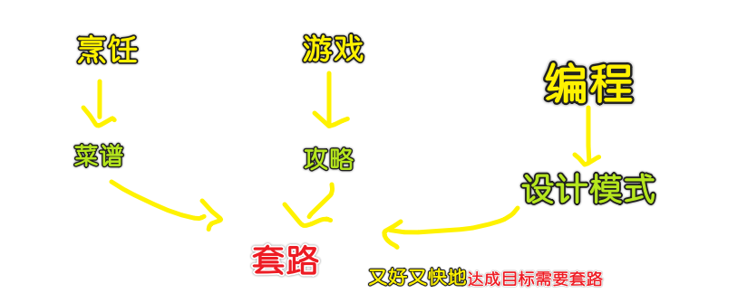
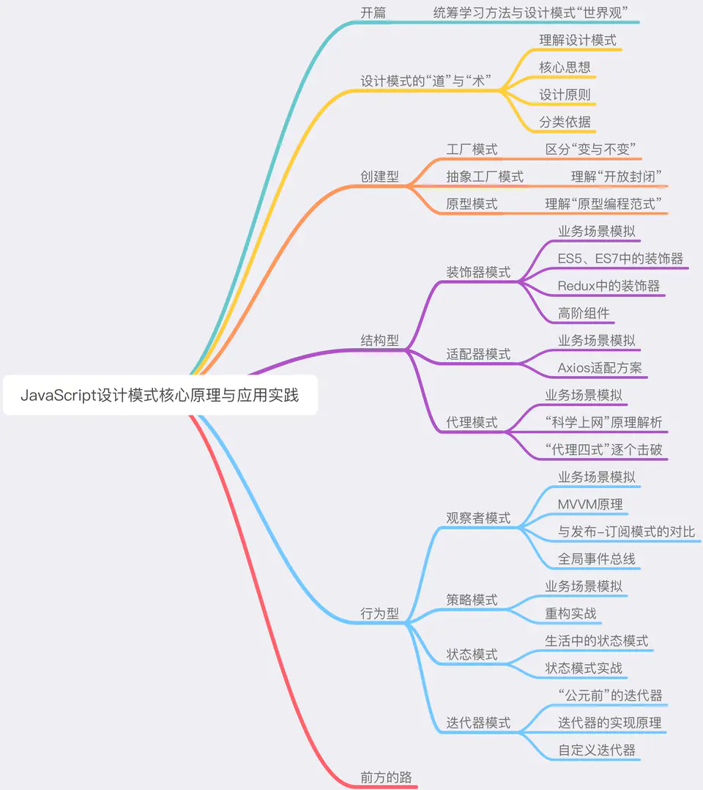

### ✍️ Tangxt ⏳ 2020-09-17 🏷️ 设计模式

# 01-JavaScript 设计模式核⼼原理与应⽤实践

> [教程](https://juejin.im/book/6844733790204461070)

## ★为什么学设计模式？

具体点来说，工程师对设计模式的掌握程度：

> 一定程度上反映着他用健壮的代码去解决具体的问题的能力。

所以，设计模式如今已经成为**前端面试中无法回避、同时具有较高候选人区分度的一个核心考点**。

因此，基于面试、工作的双重需要，我们不得不学习设计模式！

## ★设计模式难学吗？

设计模式的“难”，在于其令人望而生畏的**抽象性**和知识点的**分散性**

而这本小册可以**帮助大家摆脱枯燥乏味的技术恐惧感**，最大程度上降低前端设计模式的学习成本。

## ★设计模式是什么？

**它是一个非常接地气、非常实际、非常好理解的东西**——因为它本身就是一帮非常苦逼的程序员在自己的职业生涯里实打实地踩坑踩出来的。

## ★如何学习设计模式？

本书的重点不在于对固有理论的反复阐述，而是**把读者放到一个正确的场景里、去体会每一个设计模式的好**。甚至贯穿设计模式始终的设计原则理论，也会被我们化解到具体的、易于理解的场景片段里去。本书具体的知识结构用思维导图展示如下：

“橘生淮南则为橘，橘生淮北则为枳”（比喻环境变了，事物的性质也变了）——一些在服务端应用场景下看似合理、好用又酷炫的操作，生搬硬套到前端的场景里可能就会弄巧成拙。**本书的目的并不是做传统设计模式书籍的“译本”，而是面向前端工程师，讲有利于前端的技术**。因此在正式的实战章节里，我们权衡每种模式对前端的价值、对 23 种设计模式做了取舍，保留下来的这些设计模式，具备这两个共性：

- 前端能用，而且好用；
- 面试会考，而且常考。

总之，重点学习设计模式中那几个**特别重要、特别好使、特别受面试官关注**的设计模式！

> 我突然明白为啥不用学 24 种设计模式了！ -> 因为在前端这个环境里边，合适用的就那么 10 种左右的设计模式！

## ★我会学到什么？

通过对本书的学习，我们至少可以达到**三个目的**：

- 充分理解前端设计模式的核心思想和基本理念，在具体的场景中掌握抽象的设计原则
- 掌握前端应用场景中最核心的设计模式
- 会写代码，会写好代码；
- 会面试，能言之有物。
- 会学习，掌握学习方法，不再畏惧看似艰深晦涩的软件理论知识

## ★目录

- [01-开篇：前端工程师的成长论](./01.md)
- [02-设计模式的「道」与「术」](./02.md)