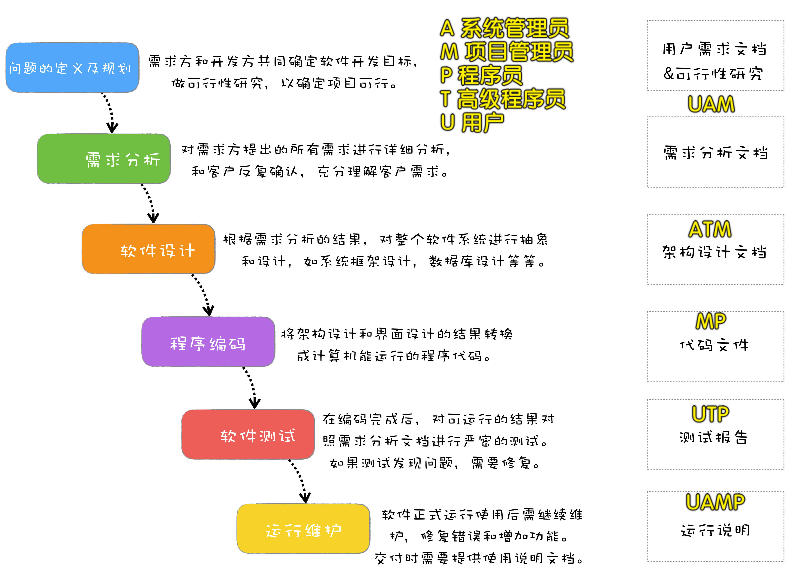

### ✍️ Tangxt ⏳ 2020-10-28 🏷️ 类图

# 01-类图

> 这是前导课 -> 意味着你只要听一遍就好了，不需要深挖某些概念之类的，毕竟这对于前端来说，这用得不多 -> 总之，别人提到了这些概念，你能看懂、知道这些概念就行了！

## ★学习目标

1. 软件生命周期
2. 软件开发模型
3. 如何画一些常见的 UML 图

## ★软件生命周期

1）可行性分析报告和软件开发计划

产出**可行性分析报告**

> 这个软件能做吗？为什么能做？

2）需求分析阶段

- 由软件分析师来做，需要懂技术也需要懂业务 -> 派几个人去企业或者单位里边调研，看看它们原来的软件是什么样子，什么样的形式，怎么运行的，它们有哪些需求，有哪些痛点需要满足……
- 分析出软件需要完成什么功能
- 产出**需求分析说明书**和**初步的用户手册**（用户的需求）

> 用户手册是详细描述软件的功能、性能和用户界面，使用户了解如何使用该软件

➹：[3 种方法来编写用户说明书](https://zh.wikihow.com/%E7%BC%96%E5%86%99%E7%94%A8%E6%88%B7%E8%AF%B4%E6%98%8E%E4%B9%A6)

3）软件设计（概要设计和详细设计）

- 由架构师/项目经理来做
- 根据团队技术基础确定用什么技术栈（Java/Node/GO/PHP） -> PHP 前景不大了……团队目前的大部分成员会什么，那就用什么呗……
- 确定部署的操作系统 -> 一般企业里边都会用 Linux
- 使用什么数据库（Oracle/MySQL/SQL Server） -> 一些企业会用国产数据库，如达梦（达梦就是把 MySQL 改改名字而已）
- 设计数据库表（用了哪些实体，哪些表）
- 选择团队成员 -> 一个项目需要 40 个人，其中某些大模块可能要分走 10 个人……
- 产出**软件设计文档** -> 软件怎么设计的？有哪些表？表里边有哪些字段？什么类型？什么关系等等

4）编码工作

- 开发人员来做
- 把设计编成代码
- 产出**源代码以及清单** -> 就是代码项目，以前（15 年前）的软件托管用的是 CVS（源代码版本管理系统）

5）测试阶段

- 由测试工程师进行
- 分为白盒测试（单元测试）和黑盒测试（功能测试）
- 产出**软件测试报告** -> 说一下软件测试多少次，出现了哪些 bug

白盒测试 -> 由开发人员自己去给每个功能加单元测试 -> 测试完后，会提交给真正的测试人员去测试，而他们做的就是黑盒测试或功能测试！

所谓的白盒和黑盒，在我看来就是，开发人员是知道这个项目是怎么弄出来的，可以自己去写代码去搞，而黑盒，不关心这个项目是如何写出来的，只关心这个交互是否有我想要的效果！

> 测试驱动开发：测试人员发现 bug，就会拼命地去催开发人员去改 bug！

6）实施和维护工作

- 由实施工程师执行
- 把项目按照需要安装和配置好（上线），让客户使用并解决简单问题
- 产出**软件维护报告**

## ★软件开发模型

1）瀑布模型

> 类似上边的软件生命周期

- 瀑布模型（Waterfall Model） 是一个项目开发架构
- 发过程是通过设计一系列阶段顺序展开的，从系统需求分析开始直到产品发布和维护，每个阶段都会产生循环反馈
- 如果有信息未被覆盖或者发现了问题，那么最好 “返回”上一个阶段并进行适当的修改，项目开发进程从一个阶段“流动”到下一个阶段，这也是瀑布模型名称的由来

瀑布模型的典型问题就是周期长、发布烦、变更难 -> 老师之前做的两个项目，采用这种模型，最后项目都黄掉了，亏了几百万……

2）增量开发模型

3）原型开发模型

